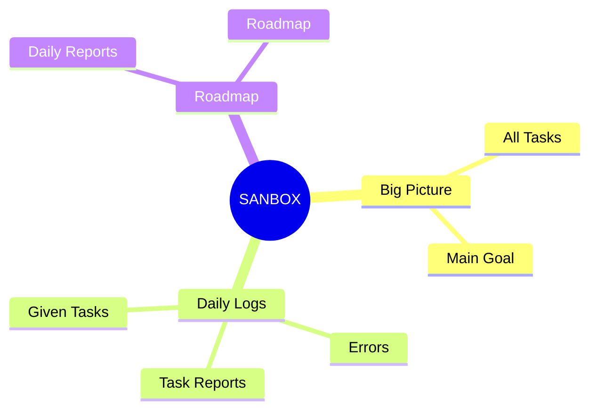

<!-- PROFİL BANNER -->

  

<!-- HAKKINDA -->
## About Me
Hello!  
I'm **ZNACH!**, and here I share the scripts, automation systems, and experimental projects I've created for **lab environments**.
My focus areas are: 
- 🔹 **Virtualization** (QEMU, KVM, Libvirt, Vagrant)  
- 🔹 **Linux System Engineering** (Debian)  
- 🔹 **Automation** (Ansible, Bash, PowerShell, Preseed)
- 🔹 **Hackintosh / OpenCore** (MacOS)

---
<!-- TEKNOLOJİ ROZETLERİ --> 
## Technologies I Use 

  

---

<!-- ACTIVITY GRAPH --> 
## Contributions Chart 

 
   

---
<!-- PROJELER -->
## Github Account Diagram

---

<!-- DİNAMİK CARDLAR -->
## Featured Projects
<table align="center">
  <tr>
    <td>
      
    </td>
    <td>
      
    </td>
  </tr>
  <tr>
    <td>
      
    </td>
    <td>
      
    </td>
  </tr>
</table>

---

<!-- İLETİŞİM -->
## Contact Me

  
  
  

---

  

