<!-- PROFİL BANNER -->

  

<!-- HAKKINDA -->
## 🔬 Hakkımda
Merhaba!  
Ben **ZNACH!**, burada **lab ortamları** için kurduğum senaryoları, otomasyon sistemlerini ve deneysel projelerimi paylaşıyorum.  
Odaklandığım alanlar:  
- 🔹 **Virtualization** (QEMU, KVM, Libvirt, Vagrant)  
- 🔹 **Linux System Engineering** (Debian)  
- 🔹 **Automation** (Ansible, Bash, PowerShell, Preseed, )  

---

<!-- TEKNOLOJİ ROZETLERİ --> 
## 🛠️ Kullandığım Teknolojiler 

  

---

<!-- GRAFİKLER -->
## 📊 GitHub İstatistikleri

  
  

---

<!-- PROJELER -->
## 📌 GitHub Hesap Diyagramı

---

<!-- DİNAMİK CARDLAR -->
## 🎯 Dinamik Görsellik
<table align="center">
  <tr>
    <td>
      
    </td>
    <td>
      
    </td>
  </tr>
  <tr>
    <td>
      
    </td>
    <td>
      
    </td>
  </tr>
</table>

---

<!-- İLETİŞİM -->
## 📡 Bana Ulaş

  
  
  

---

  

